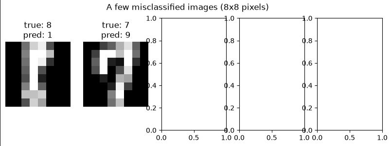

# Project Documentation

This site provides project documentation.
Use the documentation navigation to explore.

## How-To Guide

Many instructions are common to all our projects.

See
[⭐ **Workflow: Apply Example**](https://denisecase.github.io/pro-analytics-02/workflow-b-apply-example-project/)
to get the example projects running on your machine.

## Project Documentation Pages (docs/)

- **Home** - this documentation landing page
- [**Project Instructions**](./project-instructions.md)  - the standard project workflow
- [**Your Files**](./your-files.md) - how to copy the example and create your version
- [**Glossary**](./glossary.md) - project terms and concepts
- [**API**](./api.md) - autogenerated code documentation for the public project interface

## Phase 4. Technical Modification

Describe your small technical modification to the example project.

Include:

- What you changed
I replaced the logging based output  with print() statements and removed startification so the TF-IDF and Naive Bayes text classifier could run on my custom dataset.
I also replaced the original LogisticRegression model with a RandomForestClassifier and added two new visualization to show misclassified digit images.
- Why you chose that change
-   I wanted to visually see my modification and replacing the LoG.info with the print() statement helped me visualize my changes.
- My custom datset was small and did not have many statements to help classification , so keeping the startification did not provide accurate results, so I decided to remove the Stratification, which helped predict the text more accurately.
- The RandomForest model was more robust for image classification and produces interesting misclassification patterns.
- How you verified that it worked
On the Text classification, I included sentences and expected certain predictions for them , which I verified after running the code and the results were as expected.
The image pipeline, produced the overall accuracy, confusion matrix and a chart of misclassified digits.

On my Python file, I had made changes to predict Grade as my Target variable and I also verified that in my final results.

- What result, output, chart, metric, or behavior confirmed the change

The TF-IDF model successfully predicted the labels from my custom text inputs.
The Random Forest model produced clear misclassified digit images , and I was able to confirm that the new visualization worked.

Compared with the example project,
explain what is different and why the change matters.

- The example project used a LogisticRegression model and did not display any misclassification visualization whereas my custom project used a RandomForest and helped produce a clear set of misclassified digit images.
- The example text pipeline used logging and a balanced dataset whereas in my custom modification I used print statements and a custom imbalanced dataset, for validation purpose.
- I also added a target string variable "Grade" and replaced the example target variable "Score" .

Was it easy, or surprisingly challenging and why do you think so?
The coding changes were moderate but debugging the failures , indentation errors, calling a function within the loop kind of troubleshooting was more challenging.

## Phase 5. Custom Project

Describe your custom investigation of the deployed model.

### Basis and API
 Iused the deployed penguin species classifier API from the example project.

 I customized the model to RandomForestClassifier and trained with the same dataset "Palmer Penguins" that predicts the penguin species  based on the input "bill_depth_mm".

### Investigation Approach

Describe how you investigated the model's behavior.

I swaped the bill_length_mm that was originally used in the example to bill_depth_mm as it was a meaningful change that I can observe.

These custom modifications helped me understand the influence of a feature on a species prediction and how the model switches species. I also understood whether the difference in the swithch of species was smooth or abrupt.
### Findings: Feature Sensitivity

Describe what you observed when varying individual features.

Whle running the example file with bill_length_mm as the target feature the result produced two gradual transition. Adelie to Chinstrap - Gentoo and the boundary was not sharp as the bill_length overlaps between species, but when I switched the feature to bill_depth_mm the model switched species abruptly as bill_depth increased.

### Findings: Edge Cases

Describe what happened with unusual or invalid inputs.
 The edge cases were that the bill_depth_mm had abnormalities like 10mm , which is too small for penguin and 25mm which is too large for penguin and they were considered to be very unrealistic though the model made predictions for these values.

### Summary

Summarize your custom investigation.

This gives me an understanding that the model looks for missing values, non-numeric inputs but not for invalid values so the predictions are unrealistic.
I would plan on including out of range values to the model to train the model to predict that the species cannot belong to any category with the extreme out of range values.

Display at least one chart or screenshot showing your findings.

